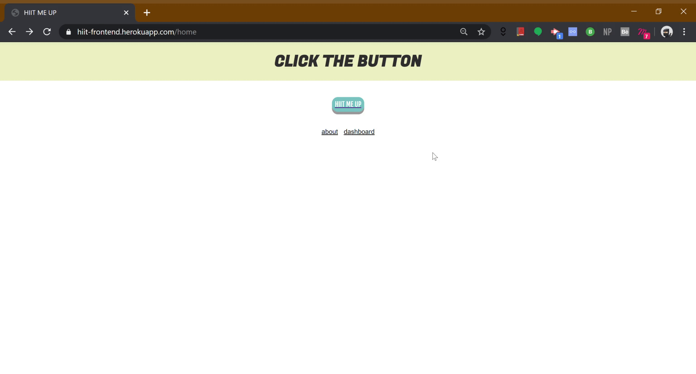

# HIIT ME UP Generator

### `Description`
This project is my first ever full-stack React project and I decided to create a random exercise generator that creates a 15min workout of 6 exercises that the user can follow and complete. 
Thereafter, the workout can be saved to a public dashboard.

With this initial version, users can:
- start a new workout
- save a workout to a public dashboard
- reset an ongoing workout



### `Stack:`

- Express
- React
- Nodejs "12.16.1"

### `Package used:`
- Axios

### `.env variables`
- HIIT_FRONTEND_KEY
- REACT_APP_HIIT_FRONTEND_URL
- REACT_APP_HIIT_BACKEND_URL

```
### `git clone`
git clone https://github.com/vallq/hiit-generator.git

### `npm install`

Install the packages in NodeJS environment.<br/>

### `npm start`

Runs the app in the development mode.<br />
Open [http://localhost:3000](http://localhost:3000) to view it in the browser.

The page will reload if you make edits.<br />
You will also see any lint errors in the console.

### `Backend Repo`
backend repo : https://github.com/vallq/hmu-backend
